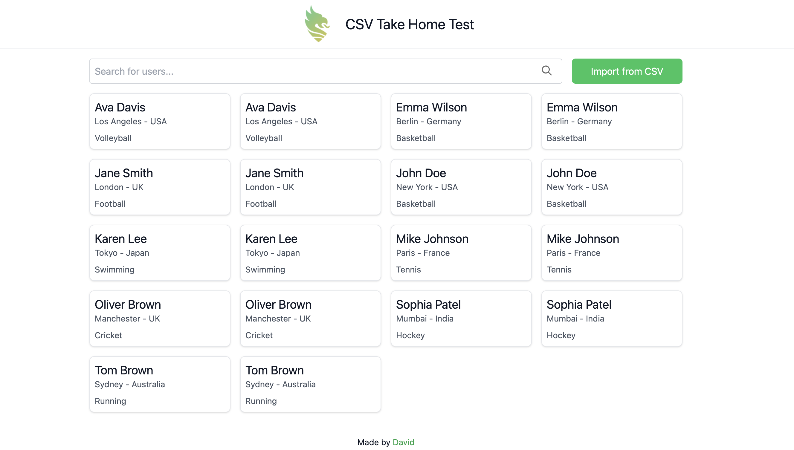

# Shaw and Partners Take Home Test

Backend Tech Stack:
- Node.js
- Express.js
- Prisma ORM
- SQLite
- Jest
- TypeScript

## Backend Installation

```bash
cd backend && npm install
```

## Backend Running

```bash
cd backend && npm run dev
```

Frontend Tech Stack:
- React.js
- Create React App
- Tailwind CSS
- Jest and React Testing Library
- TypeScript

## Frontend Installation

```bash
cd frontend && npm install
```

## Frontend Running

```bash
cd frontend && npm start
```

# Deployment

The backend and frontend are deployed on Fly.io.

Backend: https://shaw-n-partners-tht-backend.fly.dev/
Frontend: https://shaw-n-partners-tht-frontend.fly.dev/


